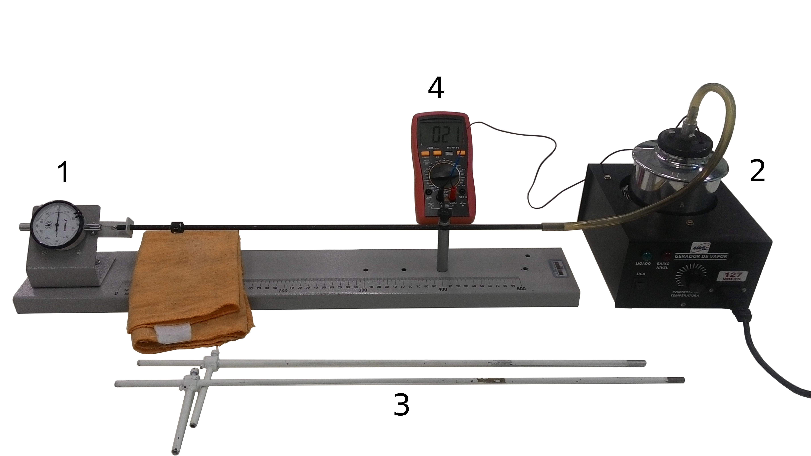

::: {.content-visible when-format="html"}
## Introdução


A temperatura de um corpo está associada à agitação térmica de suas moléculas, cuja variação provoca alterações em suas dimensões — fenômeno denominado *dilatação térmica* @Halliday2.

O fenômeno físico da dilatação tem várias aplicações práticas. Em pontes e ferrovias, utilizam-se juntas de dilatação — pequenas folgas que evitam trincas e rupturas causadas pela variação de temperatura. Já os fios elétricos não são instalados totalmente esticados, pois precisam de folga para suportar a contração em dias frios.

Embora a dilatação ocorra tridimensionalmente (_dilatação volumétrica_), quando uma ou duas dimensões são predominantemente maiores que as demais, o fenômeno pode ser aproximado como _superficial_ (duas dimensões) ou _linear_ (uma dimensão).

Para o caso da _dilatação linear_, consideremos uma haste de comprimento inicial $L_0$ à temperatura inicial $\theta_0$. Se a haste sofre uma variação de temperatura até a temperatura final $\theta$, observamos que seu comprimento passa a ser $L$. Conforme @Halliday2, tem-se:

$$
  \Delta L = \alpha L_0 \Delta \theta
$${#eq-dilatacao-linear}

em que $\Delta L = L - L_0$ é a variação de comprimento sofrida pela haste; $\Delta \theta = \theta - \theta_0$ é a variação de temperatura. O parâmetro $\alpha$ é denominado _coeficiente de dilatação linear_ e é característico do material de que é constituída a haste. A @tbl-alfa mostra o coeficiente de dilatação linear de alguns materiais.


| Material  | $\alpha$ ($^\circ$C$^{-1}$) |
|:----------|-----------------------------:|
| Alumínio  | $2,3 \times 10^{-5}$         |
| Latão     | $1,9 \times 10^{-5}$         |
| Cobre     | $1,7 \times 10^{-5}$         |
| Ferro     | $1,2 \times 10^{-5}$         |
| Aço       | $1,1 \times 10^{-5}$         |
| Platina   | $0,9 \times 10^{-5}$         |

: Coeficiente de dilatação linear de alguns materiais {#tbl-alfa .striped .hover}

<div style="text-align: left; font-size: smaller;">
  **Fonte:** @Halliday2
</div>


## Objetivos

1. Verificar que as dimensões dos materiais dependem da temperatura a qual estão submetidos;
2. Determinar o coeficiente de dilatação linear de um corpo de prova tubular metálico, utilizando um dilatômetro linear.


## Material Necessário

::: {}
{#fig-equipamento-dilatometro}

<div style="text-align: center; font-size: smaller;">
  **Fonte:** Labfis (2026)
</div>
:::

- Um dilatômetro linear composto por base sustentação horizontal única, esperas posicionadoras, e relógio comparador com precisão de 0,01 mm (1);
- gerador elétrico de vapor dotado de conexão para corpo de prova (2);
- três corpos de prova metálicos tubulares de materiais diferentes (3);
- termômetro ou multímetro digital com função de medição de temperatura (4);
- água.


## Referências

:::{#refs}
:::
::::


```{=typst}
#show bibliography: it => {
  show heading: none
  it
}

= Introdução


A temperatura de um corpo está associada à agitação térmica de suas moléculas, cuja variação provoca alterações em suas dimensões — fenômeno denominado *dilatação térmica* @Halliday2.

O fenômeno físico da dilatação tem várias aplicações práticas. Em pontes e ferrovias, utilizam-se juntas de dilatação — pequenas folgas que evitam trincas e rupturas causadas pela variação de temperatura. Já os fios elétricos não são instalados totalmente esticados, pois precisam de folga para suportar a contração em dias frios.

Embora a dilatação ocorra tridimensionalmente (_dilatação volumétrica_), quando uma ou duas dimensões são predominantemente maiores que as demais, o fenômeno pode ser aproximado como _superficial_ (duas dimensões) ou _linear_ (uma dimensão).

Para o caso da _dilatação linear_, consideremos uma haste de comprimento inicial $L_0$ à temperatura inicial $theta_0$. Se a haste sofre uma variação de temperatura até a temperatura final $theta$, observamos que seu comprimento passa a ser $L$. Conforme #cite(<Halliday2>, form: "prose"), tem-se:

$
  Delta L = alpha L_0 Delta theta
$<eq-dilatacao-linear>

#par(first-line-indent: (amount: 0cm))[em que $Delta L = L - L_0$ é a variação de comprimento sofrida pela haste; $Delta theta = theta - theta_0$ é a variação de temperatura. O parâmetro $alpha$ é denominado _coeficiente de dilatação linear_ e é característico do material de que é constituída a haste. A @tbl-alfa mostra o coeficiente de dilatação linear de alguns materiais.]

#figure(
  kind: table,
  caption: [Coeficiente de dilatação linear de alguns materiais]
)[
  #table(
    columns: (1fr, 1fr),
    align: (left, right),
    table.header([Material], [$alpha$ ($°C^(-1)$)]),
    [Alumínio], [$2,3 times 10^(-5)$],
    [Latão], [$1,9 times 10^(-5)$],
    [Cobre], [$1,7 times 10^(-5)$],
    [Ferro], [$1,2 times 10^(-5)$],
    [Aço], [$1,1 times 10^(-5)$],
    [Platina], [$0,9 times 10^(-5)$]
  )
  #v(-0.25cm)
  #text(size: 10pt)[Fonte: #cite(<Halliday2>, form: "prose")]
]<tbl-alfa>


= Objetivos

+ Verificar que as dimensões dos materiais dependem da temperatura a qual estão submetidos;
+ Determinar o coeficiente de dilatação linear de um corpo de prova tubular metálico, utilizando um dilatômetro linear.

#pagebreak()
= Material Necessário

#figure(
  image("assets/images/dilatometro.png"),
  caption: [Conjunto para estudo da dilatação linear]
)<fig-equipamento-dilatometro>
#align(center)[#text(size: 10pt)[Fonte: Labfis (2025)]]

- Um dilatômetro linear composto por base sustentação horizontal única, esperas posicionadoras, e relógio comparador com precisão de 0,01 mm (1);
- gerador elétrico de vapor dotado de conexão para corpo de prova (2);
- três corpos de prova metálicos tubulares de materiais diferentes (3);
- termômetro ou multímetro digital com função de medição de temperatura (4);
- água.


= Procedimentos

#info-box([Atenção], [

  Nesta atividade, serão manuseados objetos em alta temperatura. Para evitar acidentes, utilize a flanela para manusear os corpos de prova e tenha cuidado ao usar o gerador de vapor. 

])


+ Identifique os corpos de prova como 1, 2 e 3. Execute a montagem da @fig-equipamento-dilatometro com o primeiro corpo de prova.

+ Coloque a água dentro do gerador de vapor, caso esteja vazio.

+ Conecte a mangueira do gerador ao corpo de prova.

+ Verifique se o corpo de prova está tocando o encosto móvel do relógio comparador (isso acarreta um pequeno deslocamento do ponteiro do instrumento).

+ Cuidadosamente ajuste o aro externo do relógio comparador até que o zero da escala coincida com o ponteiro.

+ Anote, na @tbl-dados, o comprimento inicial $L_0$ do corpo de prova, bem como a temperatura ambiente $theta_0$.

+ Coloque a ponteira do termômetro (multímetro) dentro do gerador de vapor.

+ Ligue o gerador de vapor e aguarde até que se tenha fluxo contínuo de vapor saindo da haste metálica.

#info-box([Relógio comparador], [

  #figure(
    cetz.canvas({
      import cetz.draw: *
      content((0,0),
        image("assets/images/micrometro.png", width: 7cm)
      )
      line((-2.5, -2.), (-2,-1), mark: (end: "stealth"), fill:black, stroke: 2pt, name: "ajuste-grosso")
      content("ajuste-grosso.start", anchor: "north", padding: 0.1, [
        #text(size: 9pt)[#align(center)[Aro externo]]
      ])

      line((2.3, -2.), (1.3, -0.2), mark: (end: "stealth"), fill: black, stroke: 2pt, name: "ajuste-amplitude")
      content("ajuste-amplitude.start", anchor: "north", padding: 0.1, [
        #text(size: 9pt)[#align(center)[Encosto móvel]]
      ])
    })
  )

  Considere, por exemplo, que após estabilização do ponteiro do relógio comparador, este encontre-se na posição $85$, conforme figura acima. Lembrando que cada divisão do relógio comparador equivale a $0,01$ mm, então a dilatação $Delta L$ sofrida será:
  
    #nonum($ Delta L = 85 times 0,01 "mm"$) 
    #nonum($ Delta L = 0,85 "mm"$)
  
])

#set enum(start: 9)

+ Assim que o ponteiro do relógio comparador estabilizar, anote a temperatura $theta$. Esta será a temperatura final. Em seguida,  anote a variação de comprimento $Delta L$ sofrida pelo corpo de prova, mostrado no relógio comparador do dilatômetro. Preencha os campos correspondentes da @tbl-dados.

+ Repita os passos acima para os corpos de prova 2 e 3.


//#info-box([Atenção], [Conteúdo])

//== Primeira Parte])


= Análise de Resultados

#set enum(start: 1)

+ De posse dos dados, aplique a @eq-dilatacao-linear para determinar o valor experimental  do coeficiente de dilatação linear $alpha_("exp") (°C^(-1))$ para o corpo de prova 1. 

+ Compare esse valor com os valores teóricos indicados na @tbl-alfa e identifique o material de que o corpo é feito.

+ Utilize a @eq-desvio-perc para determinar o erro percentual entre o valor teórico e o valor experimental determinado acima. Preencha a @tbl-resultados.

  $
    "Erro" (%) = abs( (alpha_("exp") - alpha_("teo")) / alpha_"teo") times 100 %
  $<eq-desvio-perc>

+ Repita os passos acima para os corpos 2 e 3, completando a @tbl-resultados.

+ Analise os resultados quanto à validade do modelo teórico (@eq-dilatacao-linear). Apresente possíveis causas para a diferença entre os valores experimental e teórico.


#set heading(numbering: none)
= Referências

#bibliography("assets/references/references.bib", style: "assets/references/abnt.csl", title: none)

#set table(
  align: center+top
)


#place(
  bottom,
  float: true,
  scope: "parent", 
  clearance: 1.5em
)[
  #figure(
    kind: table,
    caption: [Coleta de dados],
  )[
    #table(
      columns: (0.6fr, 1fr, 1fr, 1fr, 1fr, 1fr),
      table.header([Corpo de prova], [$L_0$ (mm)], [$theta_0$ (°C)], [$theta$ (°C)], [$Delta theta$ (°C)], [$Delta L$ (mm)]),
      [$1$], [400], [], [], [], [],
      [$2$], [400], [], [], [], [],
      [$3$], [400], [], [], [], [],
      //table.cell(colspan: 2)[*Média*]
    )
  ]<tbl-dados>
]

#place(
  bottom,
  float: true,
  scope: "parent", 
  clearance: 1.5em
)[
#figure(
  kind: table,
  caption: [Análise de Resultados]
)[
  #table(
    columns: (0.5fr, 1fr, 1fr, 1fr, 1fr),
    table.header([Corpo de prova], [$alpha_("exp")$ (°C$""^(-1)$)], [$alpha_("teo")$ (°C$""^(-1)$)], [$Delta "Erro"$ (%)], [Material]),
    [$1$], [], [], [], [],
    [$2$], [], [], [], [],
    [$3$], [], [], [], [],
  )
]<tbl-resultados>
]
```